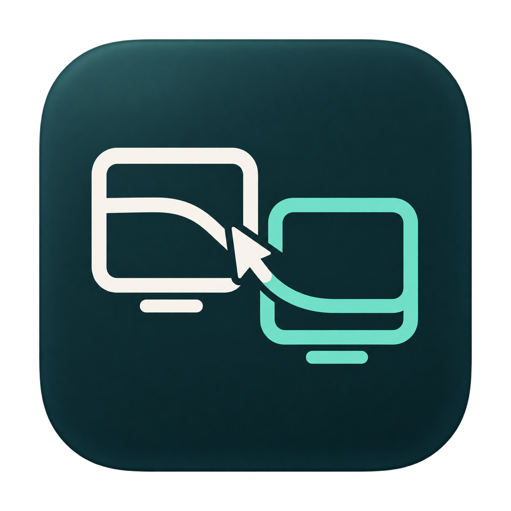

<div align="center">



# Seamlet

### Your desk, connected.

One mouse across Windows and Mac. Your clipboard comes along.


[Get started](#get-started) · [Build](#build-from-source) · [Troubleshooting](#troubleshooting) · [How it works](docs/ARCHITECTURE.md)

</div>

---

Seamlet connects a **Windows laptop with a wired mouse** to a **Mac on the same local network**. Move through the edge of the Windows screen to control Mac applications, then move back to return. Copy text or files on either computer and paste them on the other.

Both apps are native: **Swift/AppKit on Mac** and **C#/WinForms on Windows**, with a matching warm-white and teal interface, a screen arrangement preview, and clear connection and clipboard status.

> **Current direction:** the mouse is connected to Windows, and the Mac receives its input. Text and file copying work in **both directions**. Use each computer’s own keyboard.

## A smoother two-computer desk

| Feature | What you can do |
| :--- | :--- |
| **Cross-screen mouse** | Move, click, scroll, and use three mouse buttons on either computer. |
| **Screen arrangement** | Place the Mac to the left or right of Windows. |
| **Device discovery** | Select your Mac from the device dropdown, with manual IP entry as a fallback. |
| **Your own pairing code** | Enter the same letters, numbers, or phrase on both computers. |
| **Text clipboard** | Copy plain text, links, emoji, and multiline text, up to 1 MB per copy. |
| **File clipboard** | Copy up to 100 regular files, with a 1 GB total limit per selection. |
| **Edge feedback** | A brief bubble animation marks the screen you leave. |
| **Quick return** | Press **Ctrl + Alt + Esc** on Windows to bring the mouse back immediately. |

## Get started

Build the apps using the instructions below, then keep both computers on the same local network. Generated application binaries are excluded from this source repository.

### 1. Prepare your Mac

1. Open **`build/Seamlet.app`**.
2. Choose a pairing code. You will enter the same code on Windows.
3. Open **Accessibility settings…** and enable Seamlet under **Privacy & Security → Accessibility**.
4. Click **Start receiving**.

### 2. Connect from Windows

1. Copy **`build/windows/Seamlet.exe`** to your Windows computer and run it.
2. Select your Mac in the device dropdown. Click **Refresh** if it is missing, or type the Mac’s IP address shown in the Mac app.
3. Enter the same pairing code, including capitalization.
4. Choose whether the Mac is on the **right** or **left**, then click **Connect**.

### 3. Move across

Move your mouse through the configured Windows screen edge. Move through the adjoining Mac edge to return.

- **Emergency return:** press **Ctrl + Alt + Esc** on Windows.
- **Stop sharing:** click **Disconnect** on Windows, **Stop receiving** on Mac, or close either app.
- **Dragging:** release held mouse buttons before crossing. Drags stay on the computer where they began.

Pairing codes are not saved. Enter your code again when reopening the apps. If upgrading from MultipleMouse, quit the old apps first and run only one version per computer.

## Copy here. Paste there.

**Connect first, then make a fresh copy.** Seamlet transfers clipboard contents when you copy them, so wait for **“Text ready to paste”** or **“Files ready to paste”** before pasting.

| Direction | Copy | Paste |
| :--- | :--- | :--- |
| Mac → Windows | **Cmd+C** on Mac | **Ctrl+V** on Windows |
| Windows → Mac | **Ctrl+C** on Windows | **Cmd+V** on Mac |

Use each computer’s own keyboard. For files, copy a selection in Finder or Explorer and paste into a destination folder on the other computer.

**Text:** plain Unicode text up to **1 MB of UTF-8**. Formatting and embedded images are not transferred.

**Files:** **1–100 regular files**, up to **1 GB total**. Zip folders first. Symbolic links, duplicate names, and names incompatible with Windows are rejected. EXE files can be copied; Seamlet does not execute transferred files.

A newer local clipboard change takes priority over an incoming transfer. Received content does not bounce back to its source. Copying does not delete or move source files.

## Build from source

### Prerequisites

- **Mac build:** macOS 13 or later and Apple’s command-line development tools. The build uses the current Mac’s architecture.
- **Windows build:** the **.NET 10 SDK**. The default output targets **Windows x64** and includes its runtime.
- **Integration tests:** macOS with both toolchains installed.

```sh
git clone git@github.com:stevie1mat/Seamlet.git
cd Seamlet
```

### macOS

```sh
bash scripts/build-mac.sh
```

Output: **`build/Seamlet.app`**. The script applies a local ad-hoc signature; the app is not notarized.

### Windows — build on macOS or Windows

```sh
dotnet publish windows/MultipleMouse.csproj \
  -c Release -r win-x64 --self-contained true \
  -p:PublishSingleFile=true -o build/windows
```

Or, from PowerShell on Windows:

```powershell
.\scripts\build-windows.ps1
```

Output: **`build/windows/Seamlet.exe`**. Copy it to the Windows computer to run it. The project file retains the original MultipleMouse name; the application is named Seamlet.

### Icons and branding

The platform icons are included in the repository. To regenerate them on Mac from the original PNG:

```sh
bash scripts/build-brand.sh
```

Explore the [brand guide](assets/brand/README.md), [logo](assets/brand/seamlet-logo.svg), and [app icon](assets/brand/seamlet-icon.png).

## Verify a build

On Mac:

```sh
bash scripts/test.sh
```

The suite checks encrypted Swift/C# interoperability, pairing, replay and tampering rejection, message ordering, heartbeat failover, edge crossing, discovery, and bidirectional text/file transfers. Text checks include Unicode, multiline content, chunk boundaries, and the 1 MB limit. File checks include checksums, unsafe paths, interrupted transfers, and recovery.

Tests use temporary local network ports and a **private Mac pasteboard**, so they do not replace your clipboard. Windows mouse hooks, Explorer paste, firewall behavior, and physical screen-entry latency require testing on the two actual computers.

To additionally transfer the built Windows executable through the test service and verify its bytes without running it:

```sh
# Run scripts/test.sh first to build the Swift test service.
dotnet run --project tests/ProtocolTests.csproj -- files \
  "$PWD/build/file-test-host" "$PWD/build/windows/Seamlet.exe"
```

## Troubleshooting

| Symptom | What to try |
| :--- | :--- |
| **The Mac is not listed** | Start receiving on Mac, then Refresh on Windows. Try the manual IP. Guest Wi-Fi, VPNs, and firewalls may block local discovery. |
| **Pairing fails** | Check capitalization and use the same code on both computers. Surrounding spaces are ignored. |
| **Accessibility is enabled, but input fails** | Quit Seamlet and reopen the current build. If necessary, remove the old Accessibility entry and add the current app again. |
| **Paste gives old content or nothing** | Update both apps, reconnect, copy again, and wait for the destination’s Ready message. Check the clipboard status for a size, filename, or access error. |
| **A folder will not copy** | Zip it first; only regular files are supported. |
| **The mouse is on the wrong computer** | Press Ctrl + Alt + Esc on Windows. Closing either app also stops sharing. |
| **The connection drops** | Confirm both devices are awake and on the same network. Check access to the local ports listed below. |

## Local connection details

| Port | Protocol | Purpose |
| :--- | :--- | :--- |
| `24872` | TCP | Pairing, mouse input, and control messages |
| `24873` | UDP | Mac discovery |
| `24874` | TCP | Separate encrypted text and file transfers |

Input and clipboard traffic use authenticated encryption. Pairing codes are not broadcast by discovery. A strong, non-obvious pairing phrase provides better protection than a short code. See [architecture and security](docs/ARCHITECTURE.md) for the protocol, limits, and cache behavior.

## Current boundaries

Seamlet currently supports one Windows controller and one Mac receiver, using their primary screens in a left/right arrangement. It does **not** yet provide:

- A Mac-connected mouse controlling Windows.
- Shared keyboard input or image/rich-text clipboard synchronization.
- Folder transfer without zipping, or dragging files directly across screens.
- Live browser-tab migration, remote display streaming, or additional monitor layouts.

## Project map

```text
macos/          Swift receiver, native interface, discovery, and clipboard service
windows/        C# controller, native interface, mouse hooks, and clipboard client
tests/          Cross-language protocol and transfer integration tests
scripts/        Build, icon-packaging, and verification commands
assets/brand/   App icons, logo, and visual identity guide
docs/           Architecture and implementation notes
```

Found a problem? [Open an issue](https://github.com/stevie1mat/Seamlet/issues) with your OS versions, which computer has the mouse, steps to reproduce, and the status message from each app. Leave pairing codes and private clipboard contents out of the report.
